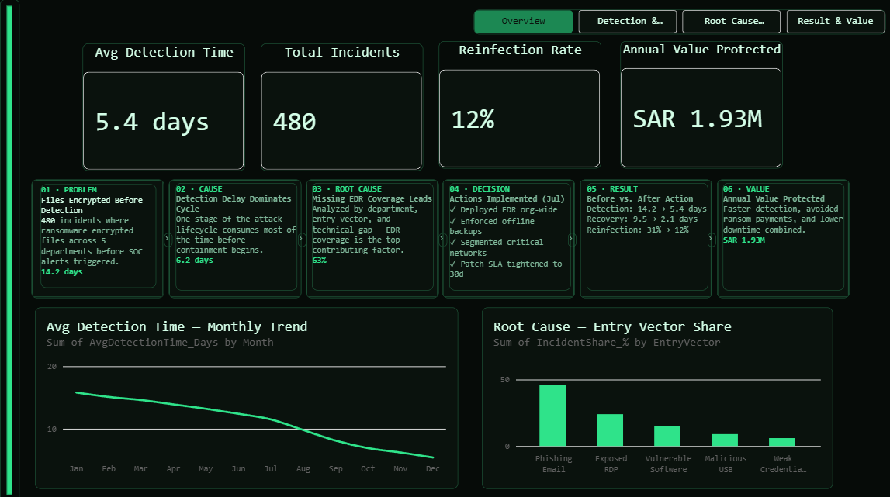
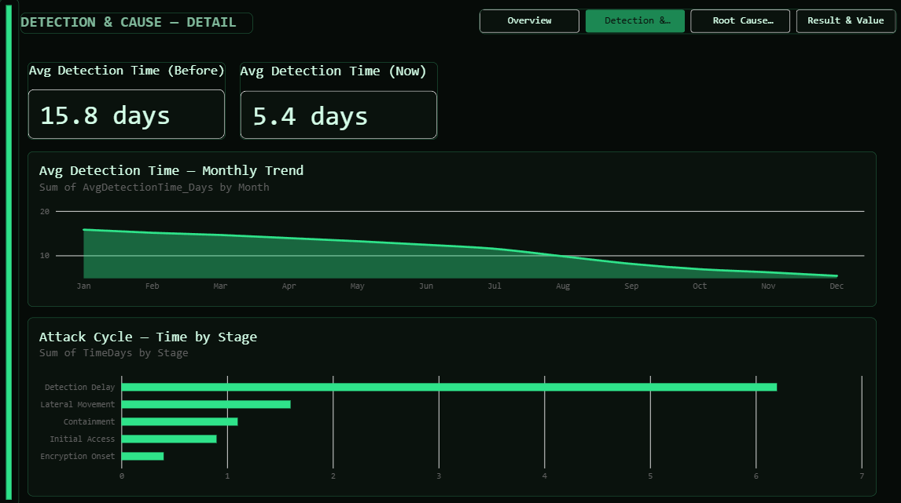
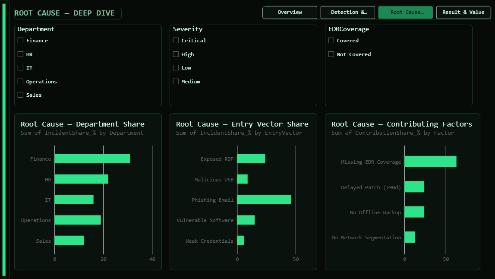
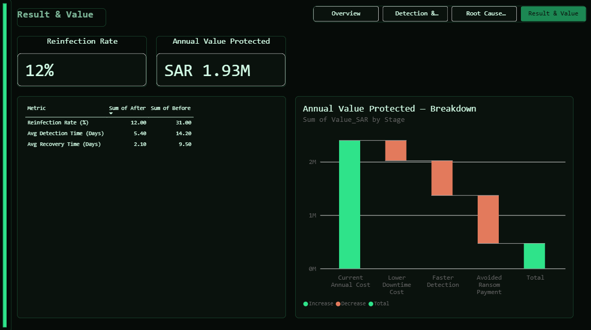
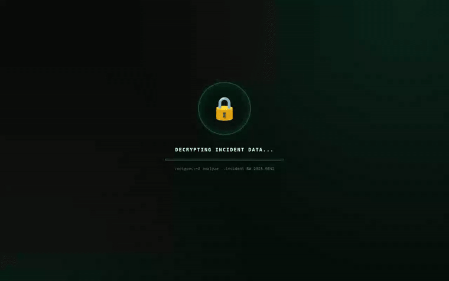

# Ransomware Incident Timeline — Power BI

A 4-page Power BI report that traces a ransomware incident end-to-end — from detection gap, through root cause, to the recovery actions taken and the value they protected. Built on a synthetic incident dataset (480 records) designed to mirror the structure of a real SOC/incident-response log.

> **Note on the data:** the dataset is simulated, created for portfolio/learning purposes. It's modeled closely on real incident-timeline data (detection delay, entry vectors, department exposure, before/after impact) to demonstrate practical DAX, data modeling, and root-cause analysis skills.

## What it shows

- **Overview** — executive KPIs (avg. detection time, total incidents, reinfection rate, value protected) plus a 6-step action flow from problem → root cause → decision → measurable result.
- **Detection & Cause** — before/after detection-time comparison and a breakdown of where time is lost across the attack lifecycle (detection delay, lateral movement, containment, initial access, encryption onset).
- **Root Cause Deep-Dive** — interactive filters (department, severity, EDR coverage) across three views: incidents by department, by entry vector, and by contributing technical factor.
- **Result & Value** — quantified impact of the response: detection time cut from 14.2 to 5.4 days, reinfection rate down from 31% to 12%, and a waterfall breakdown of the SAR 1.93M in annual value protected (lower downtime cost, faster detection, avoided ransom payment).

All four pages share a Page Navigator for cross-page navigation and a custom dark report theme.

## Screenshots

## Highlights

- **Custom DAX measures**, including text-output measures for reliable Card-visual formatting (e.g. `Avg Detection Now Text`, `Value Protected Text`), before/after comparisons, and a `Detection Improvement %` calculation.
- **Data modeling**: multiple related tables (monthly trend, cycle stages, root-cause breakdowns by department/entry-vector/factor, before/after metrics, value protected) with a Power Query–derived sort-order column for correct chronological sorting.
- **Custom report theme** (JSON) matched to a dark, security-ops visual identity.
- **Interactive filtering** via slicers on department, severity, and EDR coverage on the Root Cause Deep-Dive page.

## Bonus: interactive reveal

Alongside the report, this project includes a small interactive piece that presents the Overview page inside a "locked → unlocked → revealed" animation — a playful way to introduce the dashboard.

▶️ Try it live: **[lock_reveal.html](lock_reveal.html)** — or open it directly at [saraalzhrani7.github.io/ransomware-incident-timeline-powerbi/lock_reveal.html](https://saraalzhrani7.github.io/ransomware-incident-timeline-powerbi/lock_reveal.html) to click **TRUST ME** yourself.

## Tools

Power BI Desktop · DAX · Power Query (M) · Excel (source dataset)

---

Part of a data analytics portfolio — see more projects at [github.com/saraalzhrani7](https://github.com/saraalzhrani7).
